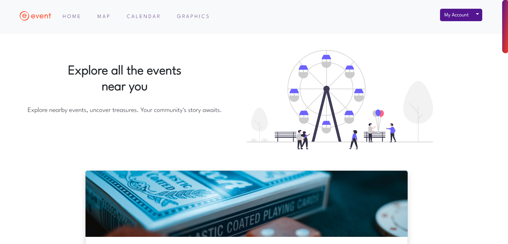

<!-- PROJECT LOGO -->
<p align="center">
  
</p>
<div align="center">
  <h1>Event App</h1>
  <p>

 
This project is a web application tailored for the effective management and promotion of events. It boasts a comprehensive feature set, including user account creation and login, event creation and management, account administration, session security, and data visualization. Additionally, the application offers interactive map and calendar views. My Events App simplifies the process of event promotion, providing a user-friendly experience for both users and event organizers.
</p>
</div>

<!-- TABLE OF CONTENTS -->
<details>
  <summary>Table of Contents</summary>
  <ol>
    <li>
      <a href="#about-the-project">About The Project</a>
      <ul>
        <li><a href="#key-features">Key Features</a></li>
        <li><a href="#built-with">Built With</a></li>
      </ul>
    </li>
    <li>
      <a href="#getting-started">Getting Started</a>
      <ul>
        <li><a href="#installation">Installation</a></li>
        <li><a href="#development- server">Development server</a></li>
      </ul>
    </li>
    <li>
      <a href="#roadmap">Roadmap</a>
    </li>
    <li>
      <a href="#contact">Contact</a>
    </li>
  </ol>
</details>

<!-- ABOUT THE PROJECT -->
## About The Project
<p align="center">
  
</p>

Event App is a web application that enables users to create, manage, and share events. Users can create accounts to keep track of their events and account information. It's designed to be user-friendly and feature-rich for event management.

### Key Features

#### User & Event Management
- **User**: Create, update, delete, and view profiles.
- **Event**: Create, update, delete, and view event details.

#### Session Management & Permissions
- **JWT Tokens**: Secure user authentication and authorization.
- **Permission Control**: Manage access to specific features and areas.

#### Map & Calendar Views
- **Map View**: Explore location-based events with an interactive map.
- **Calendar View**: Stay organized with a personalized event calendar and reminders.

#### Data Visualization
- **Event Stats**: Visualize event distribution by category.

These features provide a robust event management system with user control, security, and dynamic event exploration.


<p align="right">(<a href="#readme-top">back to top</a>)</p>

### Built With

#### Front End
* [![Angular][Angular.io]][Angular-url]
* [![Bootstrap][Bootstrap.com]][Bootstrap-url]

#### Back End
* [![JWT][JWT.io]][JWT-url]
* [![Node.js][Node.js.io]][Node.js-url]
* [![Express][Express.io]][Express-url]
* [![mySQL][mySQL.io]][mySQL-url]


<p align="right">(<a href="#readme-top">back to top</a>)</p>

<!-- GETTING STARTED -->
## Getting Started

### Installation


#### Front End

1. Clone the repo
   ```sh
   git clone https://github.com/laradelrio/frontEnd-EventsApp.git
   ```
2. Install NPM packages
   ```sh
   npm install
   ```
3. Using the Angular CLI,  generate environments
   ```sh
    ng generate environments
   ```
4. Add your Mapbox and IbbApi keys as follows:
   ```sh
    export const environment = {
    production: false,
    mapboxApiKey: 'YOUR_MAPBOX_API_KEY',
    ibbApiKey: 'YOUR_IBB_API_KEY',
    };
   ```

#### Back End

1. Clone the repo
   ```sh
   git clone https://github.com/laradelrio/-backend_EventsApp.git
   ```
2. Install NPM packages
   ```sh
   npm install
   ```
3. Create a .env file in the root directory 
4. Add the database and token secret information:
   ```sh
    DATABASE_EVENT_HOST=localhost
    DATABASE_EVENT_USER=root
    DATABASE_EVENT_PASSWORD=your_password
    DATABASE_EVENT=nodejs_events
    TOKEN_SECRET=your_token_secret
   ```
5. Install [![Nodemon.io][Nodemon.io]][mySQL-url]
   ```sh
   npm i nodemon
   ```


### Development server

#### Front End
1. Run
   ```sh
   ng serve -o
   ```
 2. Navigate to `http://localhost:4200/`. The application will automatically reload if you change any of the source files.

#### Front End
1. Start Apache and MySQL in XAMPP
2. Run
   ```sh
   nodemon server.js
   ```

#### MySQL
1. Create the data base using the nodejs_events.sql file in the Back End

<!-- ROADMAP -->
## Roadmap

- [X] User account creation and management (update account data, change password and delete account).
- [X] Event creation, display, edit, and deletion.
- [X] Map showcasing event locations.
- [X] Calendar displaying events.
- [X] Graph displaying the number of events per category.
- [X] User-friendly interface for event management.
- [ ] Filter events by category, user creation and name of the event.
- [ ] Save and sign up to events


<p align="right">(<a href="#readme-top">back to top</a>)</p>


<!-- CONTACT -->
## Contact

Lara Del Rio Garcia - lara.delrio333@gmail.com

Project Link: 
- Front End: [https://github.com/laradelrio/frontEnd-EventsApp.git](https://github.com/laradelrio/frontEnd-EventsApp.git)
- Back End: [https://github.com/laradelrio/-backend_EventsApp.git]( https://github.com/laradelrio/-backend_EventsApp.git) 

<p align="right">(<a href="#readme-top">back to top</a>)</p>


<!-- MARKDOWN LINKS & IMAGES -->
<!-- https://www.markdownguide.org/basic-syntax/#reference-style-links -->
[linkedin-shield]: https://img.shields.io/badge/-LinkedIn-black.svg?style=for-the-badge&logo=linkedin&colorB=555
[linkedin-url]: www.linkedin.com/in/lara-del-rio-garcia
[product-screenshot]: images/screenshot.png
[Angular.io]: https://img.shields.io/badge/Angular-DD0031?style=for-the-badge&logo=angular&logoColor=white
[Angular-url]: https://angular.io/
[Bootstrap.com]: https://img.shields.io/badge/Bootstrap-563D7C?style=for-the-badge&logo=bootstrap&logoColor=white
[Bootstrap-url]: https://getbootstrap.com
[Express.io]: https://img.shields.io/badge/express.js-%23404d59.svg?style=for-the-badge&logo=express&logoColor=%2361DAFB
[Express-url]: https://expressjs.com/
[Node.js.io]: https://img.shields.io/badge/node.js-6DA55F?style=for-the-badge&logo=node.js&logoColor=white
[Node.js-url]: https://nodejs.org/en
[MySQL.io]: https://img.shields.io/badge/mysql-%2300f.svg?style=for-the-badge&logo=mysql&logoColor=white
[mySQL-url]: https://www.mysql.com/
[Nodemon.io]: https://img.shields.io/badge/NODEMON-%23323330.svg?style=for-the-badge&logo=nodemon&logoColor=%BBDEAD
[Nodemon-url]:https://www.npmjs.com/package/nodemon
[JWT.io]: https://img.shields.io/badge/JWT-black?style=for-the-badge&logo=JSON%20web%20tokens
[JWT-url]: https://jwt.io/


